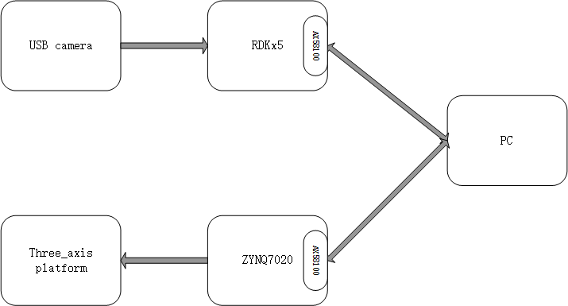
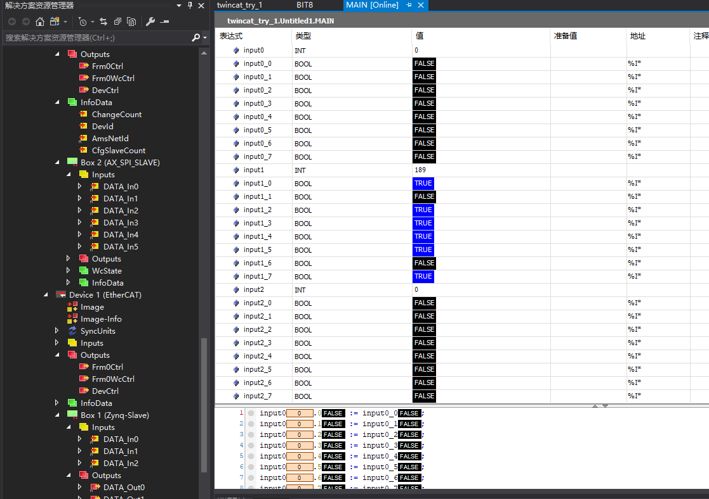

# EtherCAT 从站设计

本项目实现了一个基于 RDKx5+AX58100 的 EtherCAT 从站，并且将其应用到具体的实践当中，本项目中各文件结构如下:

1. py_prj：PC 端上的 python 程序源文件，运行 serial_ppo_1.py 可通过串口与 RDKx5 进行交互。ppo_multienv 为 github 开源的 ppo_clip 训练框架，此次仅作为展示;
2. fpga_prj_show：此处展示 zynq7020 的 PL 端 bd 设计,由于仅为扩展应用，此处不放出 bd_ui_ip 源文件;
3. RDK_prj：此处为 RDKx5 上的主要源码，共有三个应用代码：opencv 小球追踪与 EtherCAT 通信，yolov5（基于 MODELZOO 的框架进行增量训练的模型）识别追踪与 EtherCAT 通信，PPO 网络推理与串口交互;
4. TWINCAT_prj：此处为 EtherCAT 主站程序，由于 TWINCAT3 工程的特殊性，此次仅给出其打包后的 tnzip 形式，以及主要的 plc——MAIN 程序，该代码可在安装了 TWINCAT3 的电脑上直接点击打开，将自动关联到 TWINCAT3 工程;
   
   
